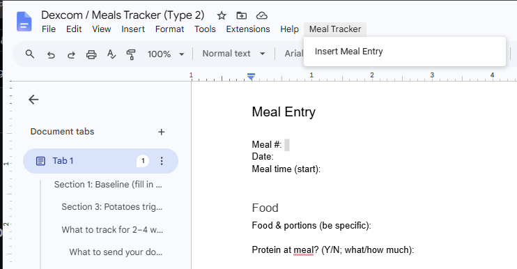
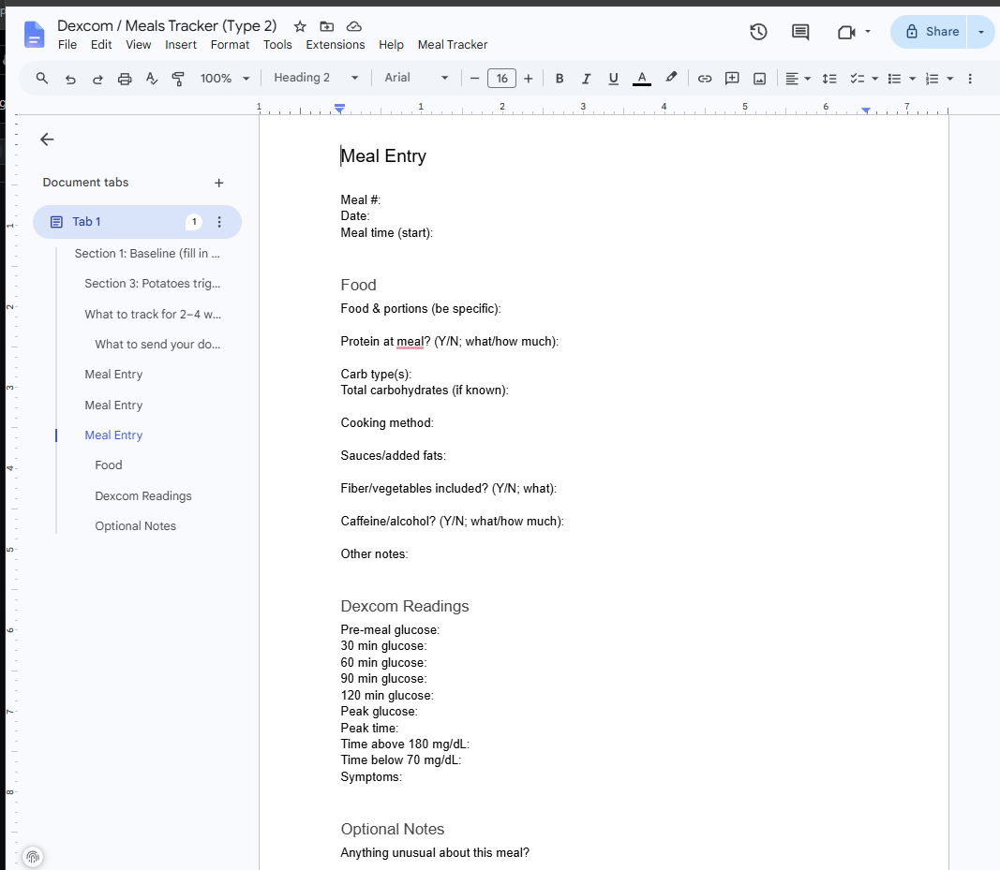

# Meal Tracker for Google Docs


A Google Apps Script tool that adds a **Meal Tracker system inside Google Docs**.

It generates structured meal logs with automatic timestamps and is designed for tracking nutrition alongside CGM data (e.g., Dexcom).


This project uses Google Apps Script to extend Google Docs beyond document editing, creating a structured health logging system designed for flexible data capture and future analysis.

---

## Why this exists

Many tracking tools optimize for either comprehensive features or strict data structures, but can introduce friction into everyday logging workflows.

This project integrates directly into Google Docs, allowing fast, flexible logging without leaving your writing environment.

This project treats Google Docs as a lightweight structured data logger rather than a traditional document editor.

## Design Goals

- Minimize friction during data entry
- Keep logs human-readable inside Google Docs
- Capture structured data without requiring a dedicated application
- Preserve flexibility while enabling future analysis
- Separate data collection from interpretation and reporting

## Project Overview

This project is maintained in GitHub and deployed via Google Apps Script.

### Source Code (GitHub)
https://github.com/jschwarzwalder/meal-tracker-google-docs-

### Apps Script Project
https://script.google.com/home/projects/1-NSvFGW8RUkGKdfPGDTA3j2KusTfoU27pTpkpnizcCoAJ4Hy3px7LzNB

### Apps Script Project ID
`1-NSvFGW8RUkGKdfPGDTA3j2KusTfoU27pTpkpnizcCoAJ4Hy3px7LzNB`

## Status

Continuously developed through real-world usage, with a focus on structured data capture and workflow optimization.

## Technical Highlights

- Google Apps Script integration with Google Docs
- Custom document rendering system for reusable templates
- Cursor-aware insertion into existing documents
- Structured logging schema designed for future data analysis
- Version-controlled development workflow using GitHub
- AI-assisted data normalization and interpretation workflow

  
## Screenshots

### Meal Tracker Menu


### Inserted Meal Entry


---

## Features

- Adds a **Meal Tracker** menu to Google Docs
- Inserts a complete meal entry template with one click
- Automatically fills in the current date
- Automatically fills in the current time
- Inserts the template at the current cursor position
- Structured entry templates for:
  - Meal tracking
  - Wake entries
  - Bedtime entries
  - Dexcom sensor changes
  - Transmitter changes
- CGM observation fields including:
  - Pre/post meal glucose
  - Peak glucose
  - Time above/below range
  - Symptoms and contextual notes
- Organized sections for:
  - Meal information
  - Food details
  - Macronutrients
  - Cooking methods
  - Fiber and vegetables
  - Caffeine and alcohol
  - Dexcom/CGM readings
  - Optional notes
 
## Example

**Meal Template Version:** 1.6

```text
Meal Entry YYYY-MM-DD HH:MM

Meal #:
Entry Type: Meal
Meal Category: Breakfast / Lunch / Dinner / Snack
Date: YYYY-MM-DD
Meal time (start/end): _____ / _____

Food

Food & portions (be specific):

Carb type(s):
Total carbohydrates (if known):

Protein type(s): (e.g. Chicken, Eggs, Cheese, Beans, Greek yogurt — full list in docs/)
Protein at meal? (what/how much):

Sauces/added fats (what):
Fiber/vegetables included? (what):
Caffeine/alcohol? (what/how much):
Cooking method:

Context/Notes

Hunger/stress/exercise/illness/ate quickly or slowly (short notes):

Dexcom Readings (start at meal time)
────────────────────────────────
Dexcom Event Log (log at meal start in Dexcom app)

Event name:
(e.g., Chicken sandwich + fries)

Meal type: Protein-heavy / Carb-heavy / Snack / Mixed / Restaurant
Estimated carbs: Low (0–20g) / Medium (20–60g) / High (60g+)
Notes (optional): Normal / Stress / Illness / Unusual Hunger / Alcohol
────────────────────────────────

Pre-meal glucose:
30 min glucose:
60 min glucose:
90 min glucose:
120 min glucose:
Peak glucose (0–2h):
Peak time (minutes after meal start or clock time):
Time >180 mg/dL (approx minutes or start–end clock times):
Time below 70 mg/dL (rough):
Symptoms:

Scheduled Glucose Checks
(If glucose readings have not been recorded, calculate suggested check times from meal start time.)

30 minutes after meal start:
60 minutes after meal start:
90 minutes after meal start:
120 minutes after meal start:

Optional Notes

Anything unusual about this meal?
Overall thoughts (1–2 lines):
```
## Project Structure

```
meal-tracker-google-docs-/
├── Code.gs                  # Apps Script: menu, templates, insertion logic
├── docs/
│   ├── diabetes-meal-log-assistant-prompt.md
│   ├── diabetes-meal-new-log-prompt.md
│   ├── diabetes-meal-prompt-test-cases.md
│   └── sample_dexcom_export*.csv
├── screenshot/               # README images
```

## Quick Start
Fastest way to get running:

1. Open a Google Doc  
2. Click Extensions → Apps Script  
3. Paste `Code.gs` from this repo  
4. Reload the document  
5. Use **Meal Tracker → Insert Meal Entry**

## Installation (Detailed)

1. Open a Google Doc.
2. Select **Extensions → Apps Script**.
3. Replace the default `Code.gs` contents with the script from this repository.
4. Save the project.
5. Reload the Google Doc.
6. Authorize the script the first time you run it.

After installation, you'll see a new **Meal Tracker** menu in the document.

## Usage

1. Place your cursor where you want the meal entry inserted.
2. Click **Meal Tracker → Insert Meal Entry**.
3. The template will be inserted with the current date and time already filled in.

## AI-Assisted Logging Workflow

This project pairs the Google Docs template system with a set of standardized
AI assistant prompts for logging, cleanup, and nutrition estimation.

The workflow is designed around a few core principles:

- **Accuracy over completeness** — the assistant never invents or assumes
  missing information (e.g. carbohydrate estimates, glucose readings).
- **Preservation of the historical record** — existing entries are updated
  in place as new information arrives (Dexcom readings, corrections,
  follow-up notes) rather than replaced or summarized away.
- **Neutral, body-positive framing** — meals are documented factually,
  without moralizing language ("good," "bad," "cheat," etc.), consistent
  with a Health At Every Size (HAES)-inclusive approach.
- **Never predicts future glucose response** — only observed CGM data is
  summarized; the assistant does not forecast how a meal *will* affect
  glucose.
- **Scheduled Glucose Checks** are designed to pair with external reminders
  (e.g. a voice assistant routine) so check times aren't missed while away
  from home.

### Prompt files

| File | Purpose |
|---|---|
| `docs/diabetes-meal-log-assistant-prompt.md` | The full assistant prompt — template rules, nutrition estimation, glucose data handling, and multi-entry log cleanup for normalizing a day's worth of notes (e.g. after logging quickly from a phone or tablet). |
| `docs/diabetes-meal-new-log-prompt.md` | A shorter, focused prompt for the moment you're about to eat and want a new entry started quickly, without loading the full prompt's cleanup/analysis rules first. |
| `docs/diabetes-meal-prompt-test-cases.md` | A test suite of logging scenarios and expected outputs, used to verify that changes to the prompts (especially the shortened new-entry prompt) don't regress behavior. |

### Estimating nutrition in practice

Depending on the situation, nutrition information comes from different sources,
in order of priority — confirmed intake first, then provided nutrition data,
then estimates:

- **Restaurant or delivery meals** (e.g. DoorDash): the assistant looks up
  published nutrition information for the item.
- **Meal kits** (e.g. Home Chef): nutrition info from the provider's website
  is pasted directly into the prompt alongside what was actually eaten.
- **Leftovers or partial portions**: a photo of the remaining food lets the
  assistant estimate how much was actually consumed versus the full recipe.
- **Frequently eaten foods**: a separate "Common Foods" tab in the Google Doc
  tracks known quantities (e.g. a nightly glass of milk, a regular meal) for
  manual reference, and can be pasted into the prompt when a meal combines
  several known items.

### Prompt Development & Testing

The new-entry prompt went through iterative testing: shortening a prompt
this thorough risked losing the accuracy and formatting guarantees of the
full version. `diabetes-meal-prompt-test-cases.md` captures the edge cases
and expected outputs used to validate each revision, allowing prompt
changes to be compared consistently rather than checked ad hoc.

## Linting

This project is written in Google Apps Script, which uses JavaScript but also provides built-in global objects such as `DocumentApp`, `Session`, and `Utilities`. Because of this, standard JavaScript linters may report false "undefined variable" errors unless those globals are declared.

For a quick syntax and style check without installing any tools locally, use the **ESLint Playground**:

**ESLint Playground:**
[https://eslint.org/play/](https://eslint.org/play/?utm_source=chatgpt.com)

Before pasting the script into the playground, add the following comment at the top of the file so ESLint recognizes the Apps Script globals:

```javascript
/* global DocumentApp, Session, Utilities */
```

The playground is useful for catching common JavaScript issues such as:

* Syntax errors
* Undefined variables
* Unused variables
* Unreachable code
* General code quality and style issues

Keep in mind that the playground does **not** understand the Google Apps Script runtime, so it cannot validate Apps Script-specific APIs or behavior. Always test the script in Google Apps Script after making changes.


## Future Ideas

### Data Quality & Standardization
- Historical entry cleanup and migration tools
- Template version tracking
- Automated detection of older entry formats
- Improved metadata for programmatic parsing

### Analysis & Reporting
- Structured data export and downstream analysis pipelines
- Meal pattern summaries
- Nutrition trend analysis
- CGM response summaries
- Sleep and glucose relationship analysis

### Workflow Improvements
- Alternative data entry interfaces
- Faster entry workflows
- Additional automated fields
- Custom reports

## Versioning

Current development version: 1.x

The project uses version markers in source files and documentation to keep templates, Apps Script code, and AI-assisted workflows synchronized.

## Contributing

Pull requests, bug reports, and feature suggestions are welcome. If you have ideas for improving the workflow or adding new tracking capabilities, feel free to open an issue.

## License

This project is licensed under the MIT License.
